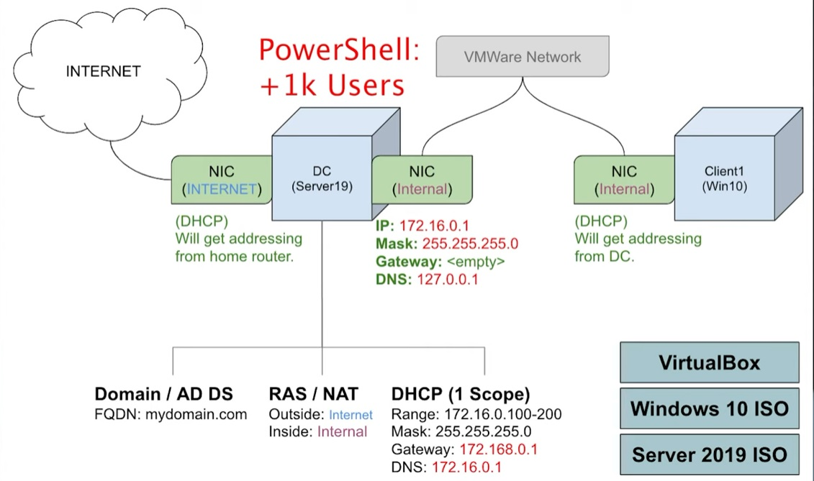

## Download and install Oracle VirtualBox from the official website.
## Download the Windows 10 and Server 2019 ISO files.
## Create a new virtual machine by clicking on "New" in VirtualBox, naming it "Domain Controller," and selecting the "Windows Server 2019" ISO file as the boot media.
##  Configure the virtual machine by giving it two network adapters: one for connecting to the internet and the other for the private network.
##  Install Server 2019 on the virtual machine and assign IP addressing for the internal network.
##  Name the server and install Active Directory to create the domain.
##  Configure routing so that clients on the private network can access the internet through the domain controller.
##  Set up DHCP on the domain controller.
##  Run the PowerShell script to create 1000 users in Active Directory.
##  Create a new virtual machine named "Client1" and install Windows 10 on it.
##  Connect the client machine to the private network and join it to the domain.
##  Log into the client machine with a domain account.